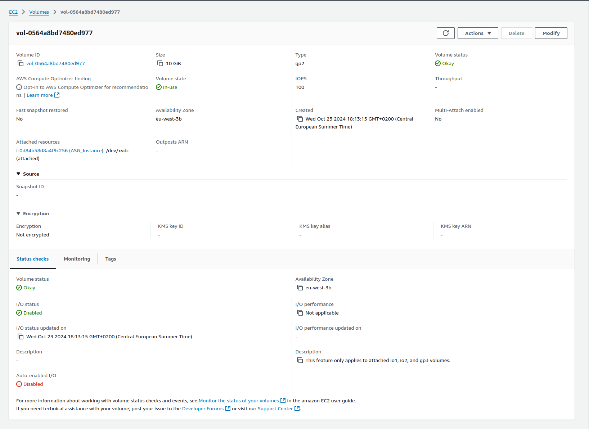

# Déploiement de WordPress sur AWS avec RDS, à l'aide de Terraform

Ce projet est de reproduire la configuration suivante à l'aide de Terraform :

***Infrastructure hautement disponible***


***Configuration de l'infrastructure:***

1. Créer un VPC avec 2 sous-réseaux publics et 2 sous-réseaux privés

2. Créer un  Passerelle Internet IG et passerelle NAT

3. Déployer une instance de base de données RDS dans un sous-réseau privé
   
   
4. Créer bastion host (instance EC2) est déployé dans le sous-réseau public pour permettre un accès SSH sécurisé aux instances EC2 privées.
   
5. Déployez un équilibreur de charge d'application (ALB) dans le sous-réseau public et connectez-le à l'instance EC2

6. Déployez une instance Wordpress EC2 dans le même sous-réseau privé et connectez-la à la base de données RDS via un groupe de sécurité
   
## Arborescence choisie

Voici comment j'ai organisé l'arborescence de mon projet :


Lançons ensuite notre projet avec les commande suivantes:
```bash
terraform init
```
```
terraform plan
```
```
terraform apply -auto-approve
```

Après avoir exécuté les commandes, la création de l'infrastructure prendra un certain temps. Pendant ce temps, vous pouvez ouvrir la console AWS et voir toutes les ressources en cours de création.

# Module Networking


# Module EC2
**Instances lancée**


**Configurer l'instance avec le serveur Web Apache**


**Block Device Mappings**


# Module RDS


**Une fois l'instance RDS disponible, notez l'URL du point de terminaison. Vous aurez besoin de ces informations pour configurer WordPress ultérieurement.**


# Wordpress
Une fois l'exécution terminée, vous pouvez accéder à l'adresse IP du serveur Web et installer WordPress .

Il vous sera demandé de fournir des informations sur l'hôte de la base de données, le nom d'utilisateur, le mot de passe, etc.

Après avoir terminé les étapes, vous atterrirez sur votre site WordPress.


Remplissez les détails requis et connectez-vous.


Voilà, nous avons déployé Wordpress avec succès conformément à la tâche.

# Terraform détruit

Pour supprimer toute votre configuration, utilisez la commande suivante. Elle supprimera toutes les ressources que vous avez créées à l'aide de Terraform.

```bash
terraform destroy -auto-approve
```


**Finalement, nous avons terminé avec succès toutes les tâches et notre projet est terminé.**

Dépôt Github : 